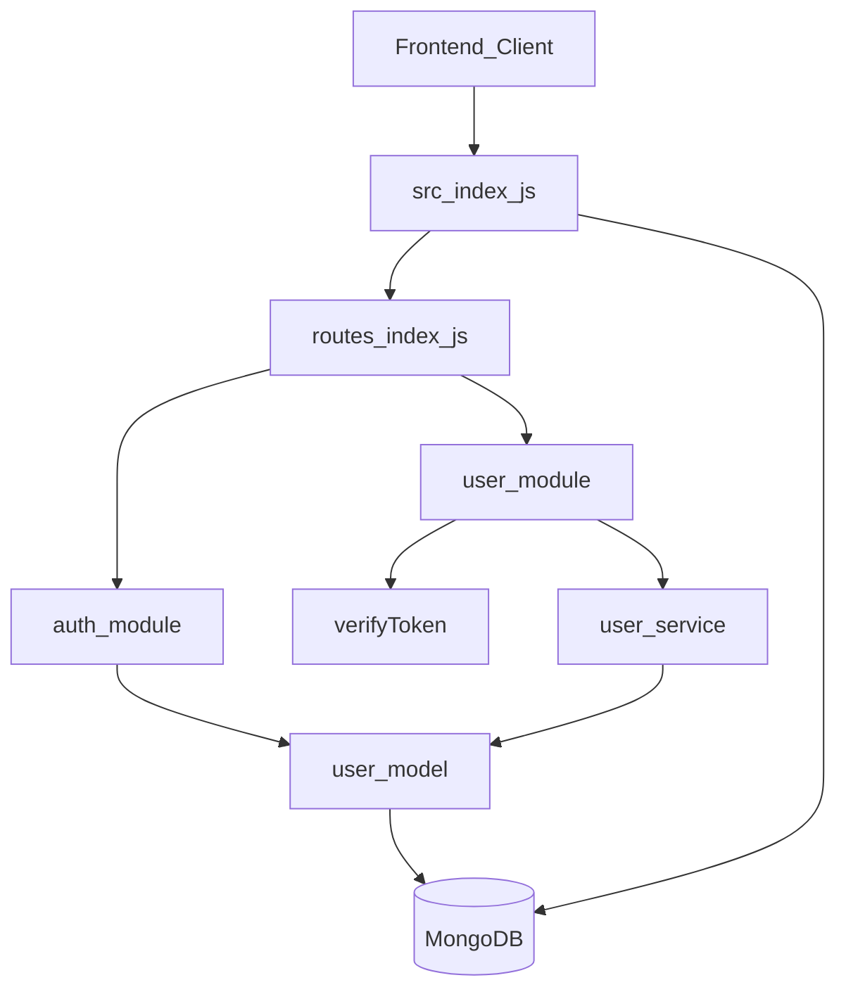
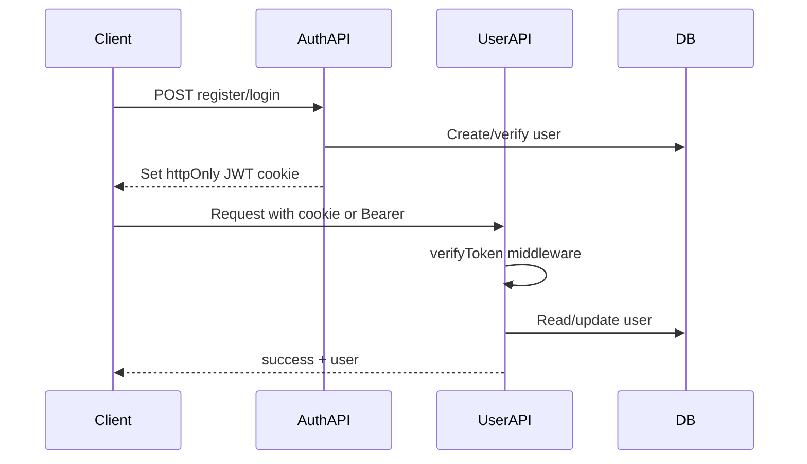

# InterviewIQ Backend Documentation

This document is the authoritative reference for the InterviewIQ backend service. It describes **what is implemented today**, how the system is structured, and how to work with it. For a quick start, see [README.md](./README.md). For naming conventions and the target architecture, see [InterviewIQ_Backend_Guidelines.md](./InterviewIQ_Backend_Guidelines.md).

InterviewIQ is a monorepo interview platform. The backend is a Node.js/Express REST API that serves the React frontend in [`../frontend`](../frontend).

**Current maturity:** Authentication (register/login) and user profile management are implemented. The aptitude module and several planned infrastructure pieces exist only as placeholders.

---

## Tech Stack

| Layer | Technology |
|-------|------------|
| Runtime | Node.js (ES modules — `"type": "module"`) |
| Framework | Express 5.x |
| Database | MongoDB via Mongoose 9.x |
| Authentication | JWT (`jsonwebtoken`) + HTTP-only cookies + Bearer header |
| Password hashing | `bcrypt` (auth controllers) |
| Validation | `express-validator` (user module); manual checks (auth middleware) |
| CORS / cookies | `cors`, `cookie-parser` |
| Config | `dotenv` |
| Testing | Jest + Supertest |
| Test database | Local MongoDB (`mongodb://localhost:27017/interviewIQ_test`) |

---

## Project Structure

```
backend/
├── jest.config.js
├── package.json
├── backend.md                          # This file
├── README.md                           # Quick start
├── InterviewIQ_Backend_Guidelines.md   # Target architecture & naming
└── src/
    ├── index.js                        # Entry point (boot + listen)
    ├── config/                         # Placeholder
    ├── database/
    │   ├── models/user/
    │   │   └── user.model.js           # Only Mongoose model implemented
    │   └── seeds/
    │       ├── users.json
    │       └── users.seed.json
    ├── middleware/
    │   └── auth.middleware/
    │       ├── auth.middleware.js      # Register/login validation
    │       └── verifyToken.middleware.js
    ├── modules/
    │   ├── auth/                       # Register, login
    │   ├── user/                       # Profile, career, social links
    │   └── aptitude/                   # Placeholder only
    ├── routes/
    │   └── index.js                    # Central route aggregator
    ├── shared/                         # Placeholder
    ├── utils/                          # Placeholder
    └── test/
        ├── app.js                      # Test Express app factory
        └── setup.js                    # Test DB helpers
```

### Architecture Diagram



---

## Boot Flow

The application boots from [`src/index.js`](src/index.js):

1. Load environment variables via `dotenv.config()`
2. Create the Express app
3. Apply middleware:
   - `cookie-parser`
   - `express.json()`
   - CORS — origins: `http://localhost:5173`, `http://localhost:3000`; `credentials: true`
4. Connect to MongoDB via `mongoose.connect(process.env.MONGO_URI)`
5. Mount the central router from [`src/routes/index.js`](src/routes/index.js)
6. Listen on `process.env.PORT` (default `3000`)

There is no separate `app.js` / `server.js` split, no graceful shutdown, and no global error middleware.

### NPM Scripts

| Script | Command | Purpose |
|--------|---------|---------|
| `start` | `node ./src/index.js` | Production start |
| `dev` | `nodemon ./src/index.js` | Development with auto-restart |
| `test` | `node --experimental-vm-modules node_modules/jest/bin/jest.js` | Run Jest (ESM) |
| `seed` | `node ./src/database/seeds/user.seed.js` | Seed script (**runner file missing**) |

---

## Environment Variables

Create a `.env` file in the `backend/` directory. The `.env` file is gitignored.

| Variable | Required | Default | Purpose |
|----------|----------|---------|---------|
| `MONGO_URI` | Yes | — | MongoDB connection string |
| `JWT_SECRET` | Yes | — | JWT signing and verification |
| `PORT` | No | `3000` | HTTP server port |
| `NODE_ENV` | No | — | Set to `production` to enable secure cookies |

Example `.env`:

```env
MONGO_URI=mongodb://localhost:27017/interviewIQ
JWT_SECRET=your_secret_key_here
PORT=3000
NODE_ENV=development
```

There is no dedicated config module — variables are read directly via `process.env` in source files.

---

## API Reference

### Health Check

| Method | Path | Auth | Description |
|--------|------|------|-------------|
| `GET` | `/` | No | API health/welcome message |

**Response (200):**

```json
{
  "success": true,
  "message": "Welcome to InterviewIQ API"
}
```

---

### Auth Module

**Files:** [`src/modules/auth/auth.routes.js`](src/modules/auth/auth.routes.js), [`src/modules/auth/auth.controllers.js`](src/modules/auth/auth.controllers.js)

> **Note:** Auth routes are mounted at `/api/auth` but define paths as `/api/userAuth/...`, producing a double-prefixed URL. See [Known Issues](#known-issues-and-gaps).

| Method | Path | Auth | Description |
|--------|------|------|-------------|
| `POST` | `/api/auth/api/userAuth/register` | No | Register a new user and set JWT cookie |
| `POST` | `/api/auth/api/userAuth/login` | No | Authenticate and set JWT cookie |

#### Register

**Request body:**

```json
{
  "userName": "johndoe",
  "email": "john@example.com",
  "password": "securepassword"
}
```

**Validation** (via `authRegisterMiddleware`):
- All fields required
- Valid email format
- `userName` and `email` must not already exist

**Response (201):**

```json
{
  "success": true,
  "message": "User registered successfully"
}
```

#### Login

**Request body:**

```json
{
  "email": "john@example.com",
  "password": "securepassword"
}
```

**Validation** (via `authLogginMiddleware`):
- Email and password required
- Valid email format
- Email must exist in the database (password verified in controller)

**Response (200):**

```json
{
  "message": "User logged in successfully"
}
```

#### Cookie Settings

On successful register or login, an HTTP-only `token` cookie is set:

| Option | Value |
|--------|-------|
| `httpOnly` | `true` |
| `sameSite` | `strict` |
| `secure` | `true` when `NODE_ENV === 'production'` |
| `maxAge` | 7 days |

JWT payload: `{ id: <userId> }`, expires in 7 days.

---

### User Module

**Files:** [`src/modules/user/user.routes.js`](src/modules/user/user.routes.js), [`src/modules/user/user.controller.js`](src/modules/user/user.controller.js), [`src/modules/user/user.service.js`](src/modules/user/user.service.js), [`src/modules/user/user.validator.js`](src/modules/user/user.validator.js)

All routes are prefixed with `/api/user` and require the `verifyToken` middleware.

**Standard success response:**

```json
{
  "success": true,
  "user": { /* User document without password */ }
}
```

#### Profile

| Method | Path | Validator | Description |
|--------|------|-----------|-------------|
| `GET` | `/api/user/profile` | — | Get authenticated user's profile |
| `PATCH` | `/api/user/profile/display-name` | `updateDisplayNameValid` | Update `profile.displayName` |
| `PATCH` | `/api/user/profile/bio` | `updateBioValid` | Update `profile.bio` (max 300 chars) |

#### Career

| Method | Path | Validator | Description |
|--------|------|-----------|-------------|
| `PATCH` | `/api/user/career/target-role` | `updateTargetRoleValid` | Update `career.targetRole` |
| `PATCH` | `/api/user/career/skills` | `updateSkillsValid` | Replace `career.skills` array |

#### Education

| Method | Path | Validator | Description |
|--------|------|-----------|-------------|
| `POST` | `/api/user/career/education` | `addEducationValid` | Add an education entry |
| `PATCH` | `/api/user/career/education/:educationId` | `updateEducationValid` | Update an education subdocument |
| `DELETE` | `/api/user/career/education/:educationId` | `deleteEducationValid` | Remove an education subdocument |

#### Experience

| Method | Path | Validator | Description |
|--------|------|-----------|-------------|
| `POST` | `/api/user/career/experience` | `addExperienceValid` | Add an experience entry |
| `PATCH` | `/api/user/career/experience/:experienceId` | `updateExperienceValid` | Update an experience subdocument |
| `DELETE` | `/api/user/career/experience/:experienceId` | `deleteExperienceValid` | Remove an experience subdocument |

#### Social Links

| Method | Path | Validator | Description |
|--------|------|-----------|-------------|
| `PATCH` | `/api/user/social/github` | `updateSocialLinkValid` | Update `socialLinks.github` |
| `PATCH` | `/api/user/social/linkedin` | `updateSocialLinkValid` | Update `socialLinks.linkedIn` |
| `PATCH` | `/api/user/social/portfolio` | `updateSocialLinkValid` | Update `socialLinks.portfolio` |

---

## Authentication Flow

Protected routes use [`verifyToken.middleware.js`](src/middleware/auth.middleware/verifyToken.middleware.js).

**Token sources** (checked in order):
1. `token` cookie
2. `Authorization: Bearer <token>` header

**On success:** `req.user` is set to the decoded JWT payload (`{ id: userId }`).

**Error responses (401):**

| Condition | Message |
|-----------|---------|
| Missing token | `"Access denied. Authentication token is missing."` |
| Expired token | `"Token has expired."` |
| Invalid token | `"Invalid authentication token."` |



---

## Data Model

The only implemented model is **User** in [`src/database/models/user/user.model.js`](src/database/models/user/user.model.js).

All profile, career, and social data is embedded in a single document — there are no cross-collection references or `populate` usage.

### User Document Structure

| Section | Field | Type | Notes |
|---------|-------|------|-------|
| **Auth** | `userName` | String | Required, unique |
| | `email` | String | Required, unique, lowercase |
| | `phone` | String | Unique, sparse (optional) |
| | `password` | String | Required, `select: false` |
| **Profile** | `profile.avatar` | String | Default `""` |
| | `profile.displayName` | String | Default `""` |
| | `profile.bio` | String | Max 300 chars |
| **Career** | `career.targetRole` | String | Default `""` |
| | `career.skills` | String[] | Array of skill names |
| | `career.education` | Education[] | Embedded subdocuments |
| | `career.experience` | Experience[] | Embedded subdocuments |
| **Social** | `socialLinks.github` | String | Default `""` |
| | `socialLinks.linkedIn` | String | Default `""` |
| | `socialLinks.portfolio` | String | Default `""` |
| **System** | `profileCompleted` | Boolean | Default `false` |
| | `createdAt` / `updatedAt` | Date | Auto-managed timestamps |

### Education Subdocument

| Field | Type | Notes |
|-------|------|-------|
| `institute` | String | |
| `degree` | String | |
| `startDate` | Date | |
| `endDate` | Date | |
| `currentlyStudying` | Boolean | Default `false` |
| `_id` | ObjectId | Auto-generated |

### Experience Subdocument

| Field | Type | Notes |
|-------|------|-------|
| `company` | String | |
| `jobTitle` | String | |
| `startDate` | Date | |
| `endDate` | Date | |
| `currentlyWorking` | Boolean | Default `false` |
| `_id` | ObjectId | Auto-generated |

---

## Layered Architecture

### User Module (full stack)

```
Routes → verifyToken + validators → Controller → Service → Model
```

| Layer | File | Responsibility |
|-------|------|----------------|
| Routes | `user.routes.js` | HTTP method/path mapping, middleware chain |
| Validators | `user.validator.js` | `express-validator` input rules |
| Controller | `user.controller.js` | Request/response handling, status codes |
| Service | `user.service.js` | Business logic, field updates, subdoc CRUD |
| Model | `user.model.js` | Mongoose schema and queries |

### Auth Module (flat)

```
Routes → auth middleware → Controller → Model
```

The auth module has no service layer. Validation is handled by custom middleware in `auth.middleware.js`, and the controller interacts with the User model directly.

---

## Middleware and Validation

### Auth Middleware

[`src/middleware/auth.middleware/auth.middleware.js`](src/middleware/auth.middleware/auth.middleware.js)

| Middleware | Used on | Checks |
|------------|---------|--------|
| `authRegisterMiddleware` | Register | Required fields, email format, duplicate username/email |
| `authLogginMiddleware` | Login | Required fields, email format, email exists |

### User Validators

[`src/modules/user/user.validator.js`](src/modules/user/user.validator.js)

Uses `express-validator` (`body`, `param`) with rules for:
- Profile fields (display name, bio)
- Career fields (target role, skills)
- Education and experience subdocuments (dates, required fields, `currentlyStudying`/`currentlyWorking` logic)
- Social link URLs

### Error Handling

- **Per-controller try/catch** — no centralized error handler
- No `app.use((err, req, res, next) => ...)` global handler
- No custom error classes
- Auth responses use `{ message }` format; user responses use `{ success, message }`
- Service layer throws `Error("User not found")` etc.; controllers catch and return appropriate status codes

---

## Testing

### Configuration

| File | Purpose |
|------|---------|
| [`jest.config.js`](jest.config.js) | Node environment, 600s timeout, mock reset, `forceExit: true` |
| [`src/test/app.js`](src/test/app.js) | `createApp()` — minimal Express app (cookie-parser, JSON, router; no CORS) |
| [`src/test/setup.js`](src/test/setup.js) | `connectTestDB`, `closeTestDB`, `clearTestDB` |

### Running Tests

```bash
npm test
```

**Requirements:** Local MongoDB running on port `27017`. Tests use database `interviewIQ_test`.

### Test Flow

1. `beforeAll` — set `JWT_SECRET`, connect to test database
2. `beforeEach` — clear database, create test user, sign JWT
3. `afterAll` — drop database and disconnect

### Coverage

[`src/modules/user/user.test.js`](src/modules/user/user.test.js) — integration tests for user endpoints using Supertest with `Authorization: Bearer <token>`.

Covers: profile read/update, career fields, education CRUD, experience CRUD, social links, and 401 without token.

**Not covered:** Auth module (register/login) has no tests.

---

## Seeds

| File | Content |
|------|---------|
| [`src/database/seeds/users.seed.json`](src/database/seeds/users.seed.json) | 100 sample users with full profiles |
| [`src/database/seeds/users.json`](src/database/seeds/users.json) | Near-duplicate seed data (~100 users) |

Seed records include `userName`, `email`, `phone`, pre-hashed `password`, `profile`, `career`, `socialLinks`, and `profileCompleted`.

**Gaps:**
- `npm run seed` references `user.seed.js`, which does not exist — the seed command will fail
- Seed passwords are SHA-256 hex hashes, not bcrypt — they are incompatible with the login flow

There is no migration tool. Schema changes are managed directly through Mongoose.

---

## Planned vs Implemented

| Area | Status |
|------|--------|
| Auth (register, login) | Implemented |
| User profile, career, education, experience, social links | Implemented |
| Aptitude module (categories, topics, questions, bookmarks, progress) | Planned only |
| Separate `app.js` / `server.js` / `connection.js` | Planned |
| `config/`, `shared/`, `utils/` directories | Empty placeholders |
| Global error handler, request logging | Not implemented |
| Additional models (`UserProfile`, `AptitudeCategory`, etc.) | Planned per guidelines |

See [InterviewIQ_Backend_Guidelines.md](./InterviewIQ_Backend_Guidelines.md) for the full target architecture.

---

## Known Issues and Gaps

1. **Auth route paths are double-prefixed** — routes mount at `/api/auth` but define `/api/userAuth/...`, producing `/api/auth/api/userAuth/register` and `/api/auth/api/userAuth/login`.
2. **Missing seed runner** — `npm run seed` points to `user.seed.js`, which does not exist.
3. **No `validationResult` handler** — `express-validator` chains are attached to user routes but there is no middleware to return `400` on validation failures.
4. **Inconsistent response format** — auth module returns `{ message }`; user module returns `{ success, message }` or `{ success, user }`.
5. **`nodemon` not in dependencies** — the `dev` script uses `nodemon` but it is not listed in `package.json`.
6. **Unused dependencies** — `bcryptjs` is listed but unused (auth uses `bcrypt`); `mongodb-memory-server` is installed but tests connect to a local MongoDB instance instead.

---

## Dependencies

### Production

| Package | Purpose |
|---------|---------|
| `express` | HTTP server |
| `mongoose` | MongoDB ODM |
| `dotenv` | Environment variable loading |
| `cors` | Cross-origin resource sharing |
| `cookie-parser` | Cookie parsing |
| `jsonwebtoken` | JWT authentication |
| `bcrypt` | Password hashing |
| `express-validator` | User input validation |

### Development

| Package | Purpose |
|---------|---------|
| `jest` | Test runner |
| `supertest` | HTTP assertion library |
| `mongodb-memory-server` | In-memory MongoDB (installed, not used in test setup) |

---

## Related Documentation

| Document | Description |
|----------|-------------|
| [README.md](./README.md) | Quick start and setup |
| [InterviewIQ_Backend_Guidelines.md](./InterviewIQ_Backend_Guidelines.md) | Naming conventions and target architecture |
| [src/modules/auth/README.md](src/modules/auth/README.md) | Auth module notes |
| [src/modules/user/README.md](src/modules/user/README.md) | User module notes |
| [src/modules/aptitude/README.md](src/modules/aptitude/README.md) | Aptitude module (planned) |
| [../README.md](../README.md) | Monorepo overview |
